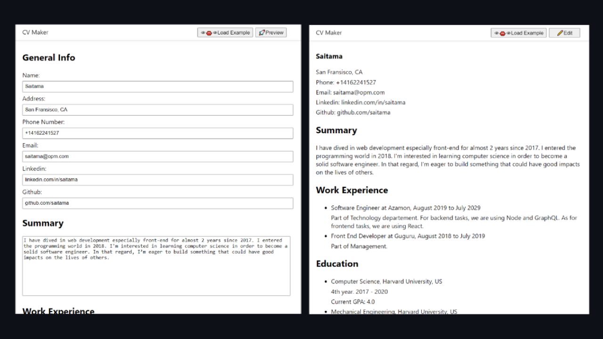

# ☁️ CV Application

CV Application/Builder built using Create React App.

### [View the demo](https://faishalirwn.github.io/cv-application/)

## Purpose

The goal of this project is to implement my understanding of some basic React concepts:

- State and Props
- Handle Inputs and Render Lists

Problem encountered:

- Handling nested state
- Structuring state so that they are easy to handle
